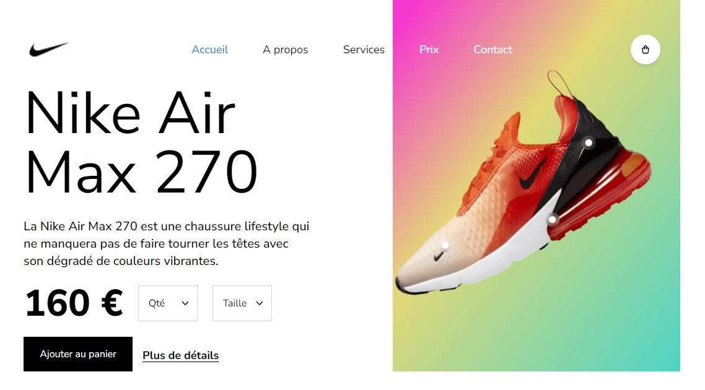

# [Nike Air](https://e-airmax.netlify.app/)

Nike Air est un site web qui permet d'ajouter à son panier la paire de basket de son choix

### Objectifs

- Créer le front end d'un e-commerce
- Apprendre **Tailwind** (responsive, animations, etc.)

### Maquette

### Instructions

- Réaliser le site avec **React**
- Un dossier par composant
- Chaque dossier devra contenir le JSX, le CSS et le JS, si besoin, du composant en question
- Utilisation de **Tailwind** pour le CSS

### Tester le projet

Pour tester le projet :

Cliquez [ici](https://e-airmax.netlify.app/) ou :
- Cloner le github
- Ouvrir votre terminal et taper la commande suivante **npm i** afin d'installer les dépendances nécessaires
- Taper **npm run dev** pour lancer le projet et le visualiser

Réalisé par [Carlos Leiroz](https://www.linkedin.com/in/carlos-leiroz/)

